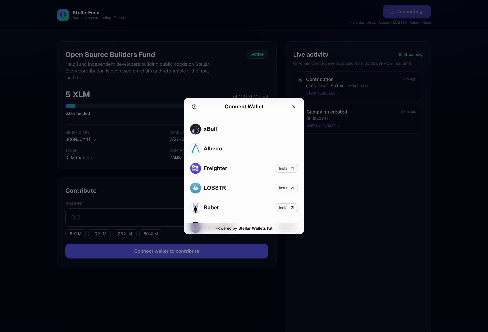
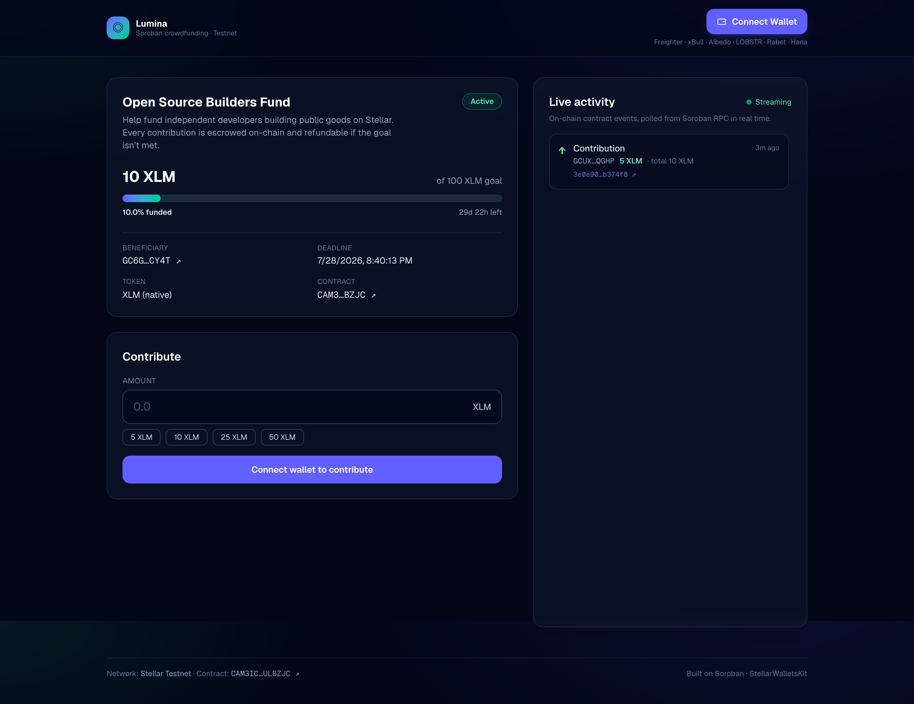

# Lumina — Soroban Crowdfunding dApp

A multi-wallet crowdfunding application on **Stellar Testnet**. Contributors fund an
on-chain campaign in XLM through a **Soroban smart contract**; the frontend reads and
writes contract state, tracks every transaction's status, and streams contract
**events in real time**.

> **Level 2 — Yellow Belt submission.** Built with production-grade software-engineering
> and security practices (typed contract bindings, checks-effects-interactions ordering,
> checked arithmetic, explicit auth, structured error handling, full unit-test coverage).

---

## 🔗 Live, on-chain facts (Stellar Testnet)

| Item | Value |
| --- | --- |
| **Deployed contract address** | [`CAM3ICMZ5IIANPDDIM3BJMBSQAO2MYYXJOZCFVVKCBMSZNXVQRULBZJC`](https://stellar.expert/explorer/testnet/contract/CAM3ICMZ5IIANPDDIM3BJMBSQAO2MYYXJOZCFVVKCBMSZNXVQRULBZJC) |
| **Contract call — `contribute` tx hash** | [`5124fcbdeb64ea76a68bc7d7e0d4f9f48cc28c32a5dc51d5117ef7257aa830a5`](https://stellar.expert/explorer/testnet/tx/5124fcbdeb64ea76a68bc7d7e0d4f9f48cc28c32a5dc51d5117ef7257aa830a5) |
| **Contract call — `initialize` tx hash** | [`b357faf9b299a241b98ec6bc6a4f445961bbfe80506e1441cc01e963fa249030`](https://stellar.expert/explorer/testnet/tx/b357faf9b299a241b98ec6bc6a4f445961bbfe80506e1441cc01e963fa249030) |
| **Deploy tx** | [`12f808a91e3d712676493b0263fdf095efe423eb78711bd4eee2333bbe5fbc12`](https://stellar.expert/explorer/testnet/tx/12f808a91e3d712676493b0263fdf095efe423eb78711bd4eee2333bbe5fbc12) |
| **WASM hash** | `90f3ea044a115f307af8856bed6ae9bca8914a575f6e9c7a50067fd89079224e` |
| **Token (campaign currency)** | Native XLM via SAC [`CDLZFC3SYJYDZT7K67VZ75HPJVIEUVNIXF47ZG2FB2RMQQVU2HHGCYSC`](https://stellar.expert/explorer/testnet/contract/CDLZFC3SYJYDZT7K67VZ75HPJVIEUVNIXF47ZG2FB2RMQQVU2HHGCYSC) |
| **Network** | Test SDF Network ; September 2015 |

All raw deployment metadata also lives in [`deployments/testnet.json`](deployments/testnet.json).

**Live demo:** deployable to **GitHub Pages** (static, see
[Deploy to GitHub Pages](#deploy-to-github-pages)) or Vercel. The app runs fully against
the public testnet contract above with zero extra configuration.

---

## 📸 Screenshots

### Multi-wallet options (StellarWalletsKit)



### Application — campaign, contribute form & live event feed



---

## ✅ Level 2 requirements — where each is met

| Requirement | Implementation |
| --- | --- |
| **Multi-wallet integration (StellarWalletsKit)** | [`web/src/lib/wallet.ts`](web/src/lib/wallet.ts) registers Freighter, xBull, Albedo, LOBSTR, Rabet & Hana via the v2 static kit API. |
| **≥ 3 error types handled** | [`web/src/lib/errors.ts`](web/src/lib/errors.ts) maps **wallet-not-found**, **user-rejected** and **insufficient-balance** (plus every on-chain contract error & network failures) into user-facing messages. |
| **Contract deployed on testnet** | See contract address above. Source: [`contracts/crowdfunding/src/lib.rs`](contracts/crowdfunding/src/lib.rs). |
| **Contract called from the frontend** | [`web/src/lib/contract.ts`](web/src/lib/contract.ts) uses the **typed bindings** generated by `stellar contract bindings typescript` for reads (`get_campaign`) and writes (`contribute`, `withdraw`, `refund`). |
| **Transaction status visible (pending / success / fail)** | Explicit **build → sign → submit → confirm** lifecycle with a live status panel & timeline ([`web/src/components/TxStatus.tsx`](web/src/components/TxStatus.tsx)). The tx hash is shown the moment it's signed. |
| **Real-time event handling & state sync** | [`web/src/lib/events.ts`](web/src/lib/events.ts) + [`useContractEvents`](web/src/hooks/useContractEvents.ts) poll Soroban RPC `getEvents`, decode topics/values, push toast notifications, and refresh on-chain state. |
| **Reading & writing contract data** | Progress bar, totals and per-account contribution are read live; contributions/withdraw/refund write state. |
| **≥ 2 meaningful commits** | See git history. |

---

## 🧱 What it does

**Lumina** runs a single crowdfunding campaign as a Soroban contract:

- **Contribute** — anyone connects a wallet and pledges XLM. Funds are escrowed in the
  contract; a `contribute` event is emitted and the progress bar updates live.
- **Withdraw** — after the deadline, if the goal was met, the beneficiary withdraws the
  funds (one-time, reentrancy-safe).
- **Refund** — after the deadline, if the goal was *not* met, contributors reclaim their
  pledges.

### Smart-contract interface

| Function | Type | Description |
| --- | --- | --- |
| `initialize(admin, token, goal, deadline)` | write | One-time campaign setup. |
| `contribute(from, amount)` | write | Pull `amount` of the token from `from`; emits `contribute`. |
| `withdraw()` | write | Admin claims funds (after deadline, goal met). |
| `refund(to)` | write | Contributor reclaims pledge (after deadline, goal missed). |
| `get_campaign()` | read | Single-call snapshot (admin, token, goal, deadline, total, withdrawn). |
| `get_total_raised()` / `get_goal()` / `get_deadline()` / `get_contribution(who)` | read | Granular getters. |

---

## 🔐 Security practices

The contract ([`contracts/crowdfunding/src/lib.rs`](contracts/crowdfunding/src/lib.rs)) was
written defensively:

- **Authorization** — `require_auth` on every state-changing entrypoint (the campaign owner
  for `initialize`/`withdraw`; the contributor for `contribute`/`refund`).
- **Checks-Effects-Interactions** — internal balances are updated *before* any outbound
  `transfer`, so a malicious token contract can't reenter and double-withdraw/refund.
- **Checked arithmetic** — all balance math uses `checked_add`/`checked_sub` and returns a
  `MathOverflow` error instead of wrapping (release profile also enables `overflow-checks`).
- **Input validation** — positive amounts, future deadline, one-time initialization.
- **Storage TTL management** — instance & per-contributor entries are bump-extended so a
  live campaign isn't archived.

The frontend never holds private keys — all signing is delegated to the user's wallet via
StellarWalletsKit. Public config values are the only thing shipped to the browser.

---

## 🗂 Project structure

```text
.
├── contracts/crowdfunding/        # Soroban smart contract (Rust)
│   └── src/{lib.rs, test.rs}      #   contract logic + 14 unit tests
├── deployments/testnet.json       # canonical deployed addresses & tx hashes
├── docs/screenshots/              # README screenshots
├── web/                           # Next.js 16 + TypeScript frontend
│   ├── src/contracts/crowdfunding.ts   # generated typed bindings
│   ├── src/lib/                   # config, wallet, contract, events, errors, format
│   ├── src/hooks/                 # useWallet, useCampaign, useContractEvents
│   ├── src/components/            # Dashboard, CampaignCard, ContributeForm, TxStatus, ActivityFeed, …
│   ├── scripts/check.ts           # standalone RPC sanity check
│   ├── Dockerfile                 # multi-stage, standalone, non-root production image
│   └── .dockerignore
├── docker-compose.yml             # one-command run of the frontend
├── Makefile                       # build / run / deploy helpers (`make help`)
├── Cargo.toml                     # Rust workspace
└── README.md
```

## 🛠 Tech stack

- **Contract:** Rust, `soroban-sdk` 26, Stellar CLI 27
- **Frontend:** Next.js 16 (App Router), React 19, TypeScript, Tailwind CSS v4
- **Stellar:** `@stellar/stellar-sdk` 16, `@creit.tech/stellar-wallets-kit` 2 (multi-wallet)
- **Contract calls:** type-safe bindings from `stellar contract bindings typescript`

---

## 🚀 Getting started

> The Soroban contract is **already deployed on Testnet**, so any of the options
> below run the app against the live contract with **zero configuration**.

### Option A — Docker (recommended, one command)

Requires Docker + Docker Compose.

```bash
make up        # builds the image and starts the app (detached)
# → open http://localhost:3000

make logs      # follow logs
make down      # stop & remove the container
```

`make up` wraps `docker compose up -d --build`. Override the host port with
`WEB_PORT=8080 make up`. Run `make help` to see every target (contract build/test,
local dev, Docker lifecycle).

### Makefile targets

| Target | What it does |
| --- | --- |
| `make up` / `make start` | Build & run the app in Docker (detached) |
| `make run` | Same, in the foreground |
| `make down` / `make restart` / `make logs` / `make ps` | Container lifecycle |
| `make clean` | Stop and remove the built image |
| `make install` / `make dev` / `make web-build` / `make lint` | Local frontend workflow |
| `make contract-test` / `make contract-build` / `make deploy` | Smart-contract workflow |
| `make check` | RPC sanity check against testnet |

### Prerequisites (for the non-Docker options)

- Node.js ≥ 20 and npm
- (Contract only) Rust + the Stellar CLI:
  ```bash
  curl --proto '=https' --tlsv1.2 -sSf https://sh.rustup.rs | sh -s -- -y
  rustup target add wasm32v1-none
  brew install stellar-cli        # or: cargo install --locked stellar-cli
  ```

### Option B — Run the frontend locally (against the already-deployed contract)

```bash
cd web
cp .env.example .env.local        # pre-filled with the live testnet contract
npm install
npm run dev                       # http://localhost:3000
```

Open the app, click **Connect Wallet**, pick a wallet (Freighter recommended; set it to
**Testnet** and fund it from <https://lab.stellar.org/account/fund>), and contribute.

> Useful RPC sanity check (no browser needed):
> `node --experimental-strip-types scripts/check.ts`

### Option C — Build, test & (re)deploy the contract — optional

```bash
# from the repo root
cargo test                                   # 14 unit tests
stellar contract build                       # -> target/wasm32v1-none/release/crowdfunding.wasm

# create + fund a deployer identity
stellar keys generate deployer --network testnet --fund

# deploy
stellar contract deploy \
  --wasm target/wasm32v1-none/release/crowdfunding.wasm \
  --source deployer --network testnet

# initialize (goal 100 XLM = 1_000_000_000 stroops; deadline = unix seconds)
stellar contract invoke --id <CONTRACT_ID> --source deployer --network testnet -- \
  initialize \
  --admin $(stellar keys address deployer) \
  --token $(stellar contract id asset --asset native --network testnet) \
  --goal 1000000000 \
  --deadline <UNIX_DEADLINE>
```

Then regenerate the typed bindings and point the frontend at the new contract:

```bash
stellar contract bindings typescript \
  --network testnet --contract-id <CONTRACT_ID> \
  --output-dir web/src/contracts/_tmp --overwrite
cp web/src/contracts/_tmp/src/index.ts web/src/contracts/crowdfunding.ts
# update NEXT_PUBLIC_CONTRACT_ID in web/.env.local
```

### Deploy to GitHub Pages

The app also ships as a fully static build, deployable to GitHub Pages with **zero
server**. A workflow ([`.github/workflows/deploy-pages.yml`](.github/workflows/deploy-pages.yml))
builds a static export (`output: "export"`) and publishes it on every push to `main`.

1. Push this repo to GitHub.
2. The workflow auto-enables Pages (Actions source) on its first run and publishes the
   app at `https://<user>.github.io/<repo>/`. _(If your org restricts auto-enable, set
   **Settings → Pages → Source = GitHub Actions** once, then re-run the workflow.)_

The workflow derives the correct `basePath` (`/<repo>`) automatically, so assets resolve
under the project sub-path. Build it locally the same way:

```bash
make pages-build BASE_PATH=/<repo>   # outputs web/out
make pages-preview BASE_PATH=/<repo> # build + serve at http://localhost:5050
```

### Deploy to Vercel

The frontend is also a self-contained Next.js server app. In Vercel, set the **Root
Directory** to `web/`, and add the `NEXT_PUBLIC_*` variables from
[`web/.env.example`](web/.env.example). No backend or server env is required.

---

## 🔄 How the real-time + status pieces work

- **Reads / state sync** — `useCampaign` polls `get_campaign()` and re-reads immediately
  after a write or a new event, so the progress bar always reflects on-chain truth.
- **Events** — `useContractEvents` backfills a recent ledger window, then pages forward
  from the RPC cursor every few seconds; new `contribute`/`withdraw`/`refund` events appear
  in the feed and pop a toast.
- **Transaction status** — each write runs `build → sign → submit → confirm`. The UI shows
  a phase timeline; on `pending` the tx hash links to Stellar Explorer; on success/failure
  it resolves to a clear message (failures routed through the error mapper).

## 📝 License

MIT — built for the Stellar Yellow Belt program.
